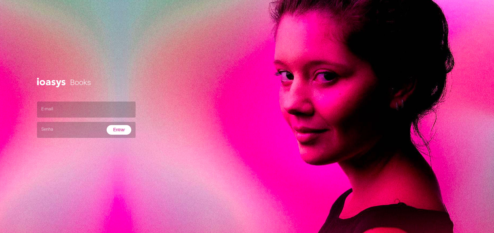

<h1 align="center">
  📚 BOOKS CHALLENGE
</h1>

<p align="center">
  
  
  
  
  
</p>


## 💻 Sobre

Projeto realizado para teste de Front-End. O objetivo da aplicação é criar um ambiente de autenticação onde os dados de login são persistidos nos cookies do usuário, caso ele retorne, ainda terá acesso enquanto a sessão de login estiver ativa.

<p align="center">
  
</p>

---
O projeto está disponível para visualização em https://books-challenge-micode.vercel.app.
A documentação dos componentes está disponível para visualização em https://books-challenge-storybook.vercel.app.


Para acessar a plataforma, use os seguintes dados abaixo:

```js
Login: desafio@ioasys.com.br
Senha: 12341234
```
---

### 🚀 Tecnologias

O projeto foi desenvolvido com as seguintes tecnologias:

- [NextJS](https://nextjs.org/)
- [Styled Components](https://styled-components.com/)
- [TypeScript](https://www.typescriptlang.org/)
- [Jest](https://jestjs.io/)
- [React Testing Library](https://testing-library.com/docs/react-testing-library/intro)
- [framer-motion](https://www.npmjs.com/package/framer-motion)
- [Prettier](https://prettier.io/)
- [Storybook](https://storybook.js.org/)
- [Eslint](https://eslint.org/)
- [Husky](https://github.com/typicode/husky)
- [Axios](https://axios-http.com/)
- [Nookies](https://github.com/maticzav/nookies)
- [nextjs-progressbar](https://www.npmjs.com/package/nextjs-progressbar)

---

### ▶️ Executando o projeto

Siga os seguintes passos para poder utilizar a aplicação em sua máquina.

1. Clone a aplicação em sua máquina local com os seguintes comandos:

```bash
git clone https://github.com/micheldslive/books-challenge.git
```

2. Depois, vá até o diretório do seu projeto utilizando o comando

```bash
cd books-challenge
```

3. Instale as dependências:

```bash
yarn install
# ou
npm install
```

4. Rode sua aplicação em sua [conexão local](http://localhost:3000)

```bash
npm run dev
# ou
yarn dev
```

---

## ▶️ Executando o projeto (Docker)

##### Com o Docker devidamente instalado e o repositório Clonado, Execute o comando abaixo:

```bash
docker compose up
```
---

### 📚 Design System
 Os principais componentes da aplicação foram documententados. Para acessá-los em sua máquina, rode o seguinte comando:

```bash
npm run storybook
# ou
yarn storybook
```
---
### 📚 Testes
Para realizar os testes rode os seguinte comando

```bash
npm run test
# ou
yarn test
```
---

## 💻 Desenvolvedor<br>

<table>
  <tr>
    <td align="center">
      <a href="https://github.com/micheldslive">
        <br>
        <sub>
          <b>Michel Domingos</b>
        </sub>
      </a>
    </td>
  </tr>
</table>

### 🖊️ Licença

O projeto é licenciado sobre a "MIT License" - Veja a pagina LICENÇA para mais destalhes.
